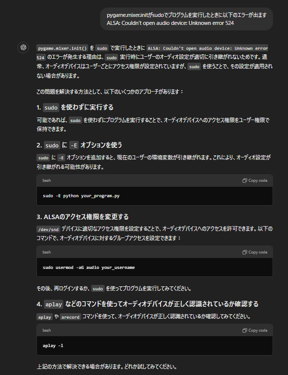

# 241028
モータ制御のコードは以下を参考にした
https://github.com/CytronTechnologies/Cytron_MDD10_Hat/blob/master/Example%20Code/Raspberry%20PI%203/HatMDD10SM.py

# 241114
rpi_ws281xはsudoじゃないと実行できないので、sudoでインストール
sudoでインストールするときは--break-system-packagesを入れないと「error: externally-managed-environment」というエラーが出る
 sudo pip3 install rpi_ws281x --break-system-packages

 同様にほかのライブラリもsudo権限でインストール
 sudo pip3 install paho-mqtt --break-system-packages

 # 1116
 ## pygame, ALSAのエラー
 
→1, 3の対応を実施したがエラー解消されない
他でも解決している人がいない
https://github.com/pygame/pygame/issues/3761
https://stackoverflow.com/questions/78483553/why-does-pygame-mixer-not-work-when-using-sudo
https://www.reddit.com/r/pygame/comments/sb99w3/pygamemixerinit_fails_when_run_as_root/

→pygame をつかわない

simpleaudio を使う（claudに進められただけ）
→以下のエラーがsudoでのみ出る。。。
Error playing sound: Error opening PCM device. -- CODE: -524 -- MSG: Unknown error 524

sudoでできるようにpygameで再度解消を試みる
以下を参考に、desired cardを設定することで解消した
https://forums.raspberrypi.com/viewtopic.php?t=360496#p2162590
https://raspberrypi.stackexchange.com/questions/95193/setting-up-config-for-alsa-at-etc-asound-conf

以下のエラーに対しては
ALSA lib pcm.c:8570:(snd_pcm_recover) underrun occurred
このパラメータを変更する
pygame.mixer.init(
                frequency=50000,  # サンプリング周波数（Hz）
                size=-16,         # サンプルサイズ（ビット）
                channels=2,       # チャンネル数（1:モノラル、2:ステレオ）
                buffer=2048       # バッファサイズ（バイト）
            )
https://stackoverflow.com/questions/65775120/alsa-lib-pcm-c8526snd-pcm-recover-underrun-occurred